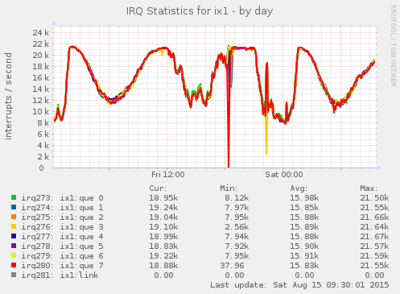
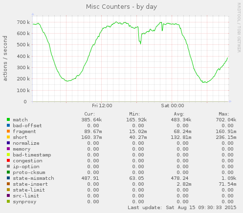

# freebsd-munin-plugins

A set of FreeBSD specific plugins for Munin

## Requirements
- All scripts are written in standard shell language, and `/bin/sh` would be sufficient.
- They are tailored and will run on FreeBSD.
- You need to install `lang/gawk` in order to run `intr_` plugin.
- You need to install `sysutils/ipmitool` in order to run `ipmi_` plugin.
- These are wildcard plugins, and should be installed using `munin-node-configure` program
- Some plugins such as `ipmi_` and `multiping_` need to have root access to run.

## Setup
1. Make sure `sysutils/munin-node` is installed
2. Enable munin-node to run at startup: `sysrc munin_node_enable YES`
2. Clone this repo and copy all scripts to `/usr/local/share/munin/plugins`
3. run `munin-node-configure --suggest` and see if the plugins are detected.
4. run `munin-node-configure --shell | sh -x` to make appropriate symlinks
5. restart munin-node if running: `service munin-node restart`

## Plugins

- **intr_** graphs CPU timers, taken from `vmstat -i` output
- **netirq_** graphs per interface and per queue (in case of multi-queue) interrupt rates, taken from `vmstat -i` output
- **netisr_** graphs per-thread/per-protocol [`netisr(9)`](https://www.freebsd.org/cgi/man.cgi?format=html&query=netisr%289%29) statistics, taken from `netstat -Q`
- **netmem_** graphs [`mbuf(9)`](https://www.freebsd.org/cgi/man.cgi?format=html&query=mbuf%289%29) statistics, taken from `netstat -m`
- **pf_** graphs [`pf(4)`](https://www.freebsd.org/cgi/man.cgi?query=pf&sektion=4&apropos=0) firewall statistics, taken from `pfctl -vsi`
- **udp_** graphs UDP protocol traffic and error statistics, taken from `netstat -s -p udp`
- **ip_** graphs IP protocol traffic and error statistics, taken from `netstat -s -p ip`
- **ipmi_** graphs temperature, fan speed and power information from hardware chassis, taken from `ipmitool`
- **multiping_** graphs RTT and PacketLoss to multiple destinations from multiple source addresses on a given network interface

## Sample Graphs

